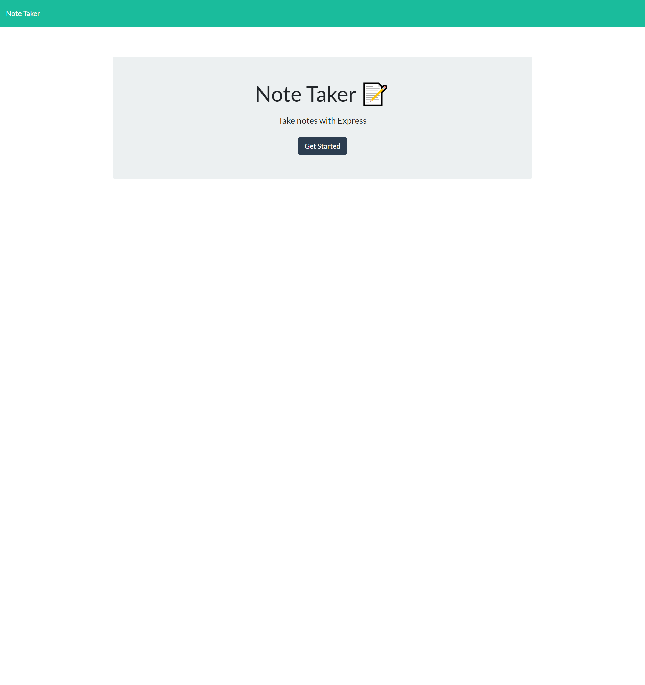
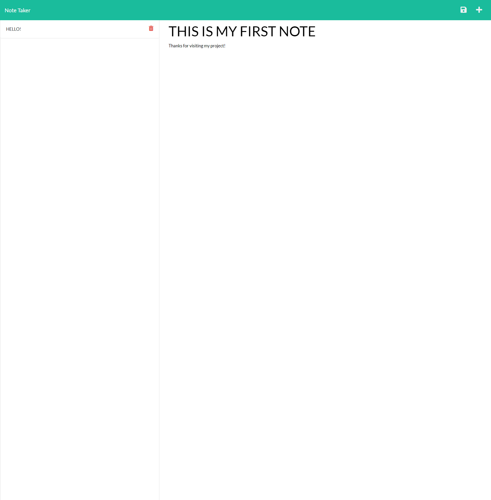
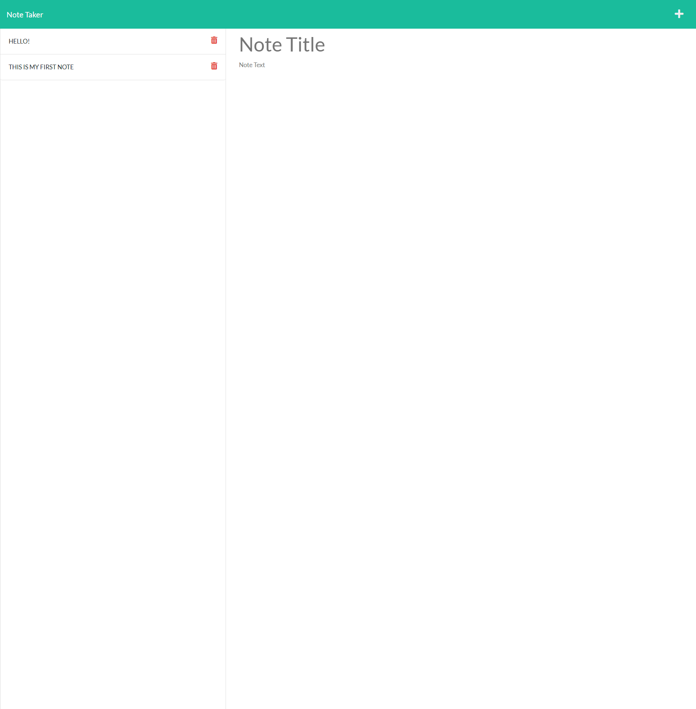
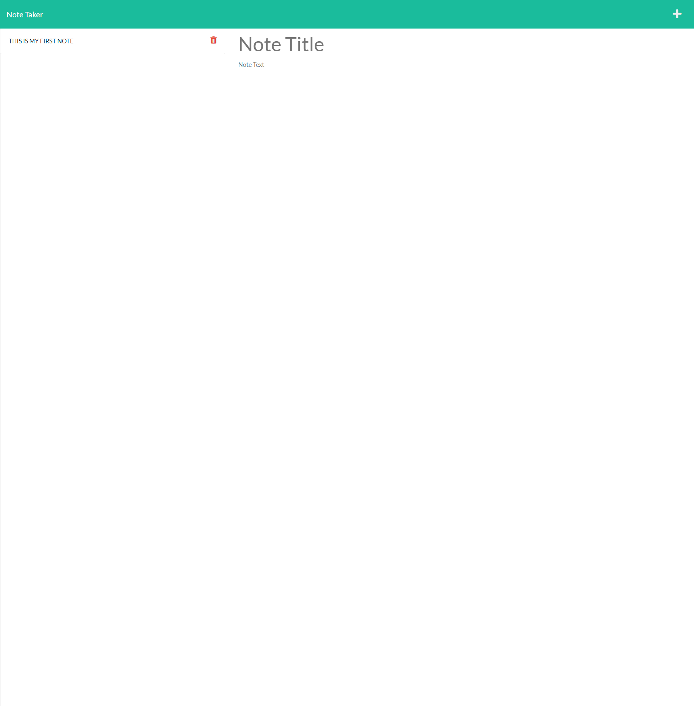
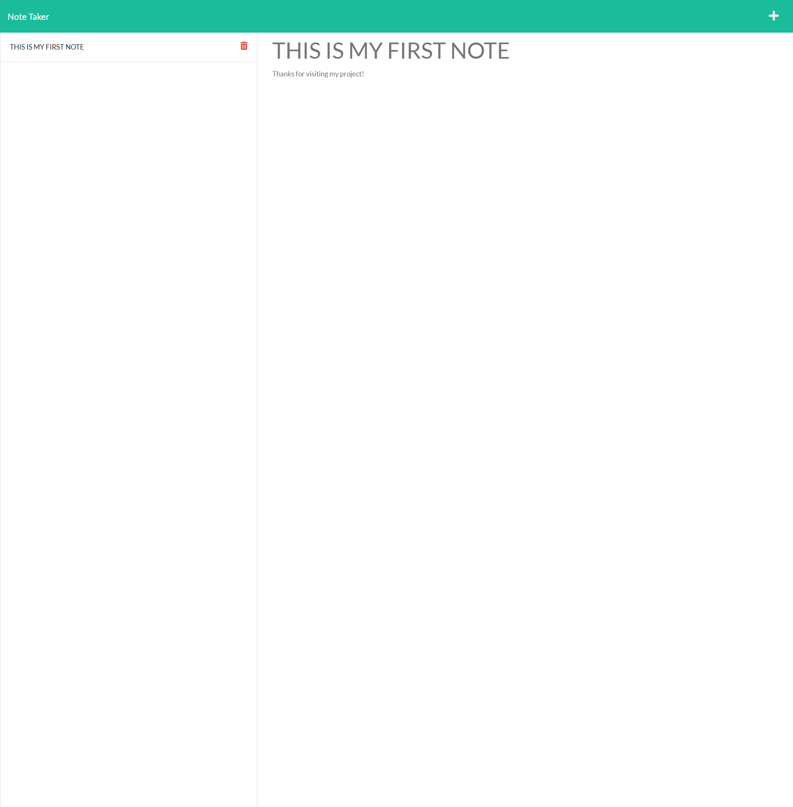

# Full-Stack Note Taker

## License:

## Table of Contents
1. [Description](#description)

2. [Installation](#installation)

3. [Usage](#usage)

4. [Testing](#testing)

5. [Contribution](#contribution)

6. [Questions](#questions)

## Description 
Given some starter code, I was tasked with connecting the front-end application with my back-end server using Express.js. This was accomplished by configuring my Express.js app to handle GET, POST, and DELETE requests and serve static files. Additionally, modular routing was implemented to facilitate future development by improving the code's readability and reducing its complexity.

## Installation 
There are no installation requirements to view this application as it is live on Heroku via the [following link](https://notatakingapplication.herokuapp.com/). However, if you would like to launch the application on your own server, you must open the root-nested server.js file, run the command npm i, and then launch the application by running node server.js in the terminal.

## Usage 
This application can be used by users looking to keep track of pending tasks, store notes and important information, or improve his/her/their organization.

Initially, the user is taken to this landing page:

After clicking get started, the user is redirected and can type their first note:

After saving, the database is updated and the note is visible on the front-end as well:

The user is also able to delete notes by clicking the trash icon:

And the website is updated respectively. Finally, the user can view a previous note by clicking on it:

## Testing 
This application has no tests.

## Contribution 
If you have any suggestions for implemmenting middleware in the application, or if you would like to improve the front-end application design, feel free to collaborate with me through the contact information below.

## Questions 
Feel free to email me at: alexis.gonzalez07@gmail.com

Visit my Github profile at: [Alex Gonzalez Github](https://www.github.com/AlexisGonzalez07)